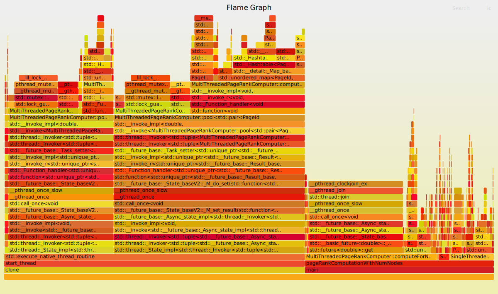
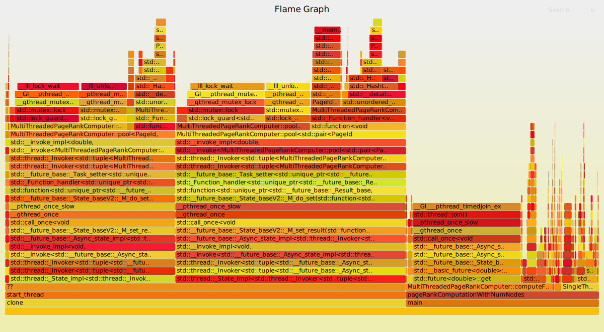
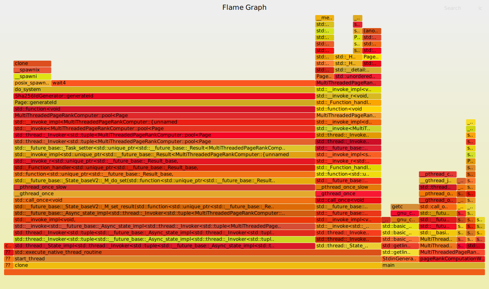
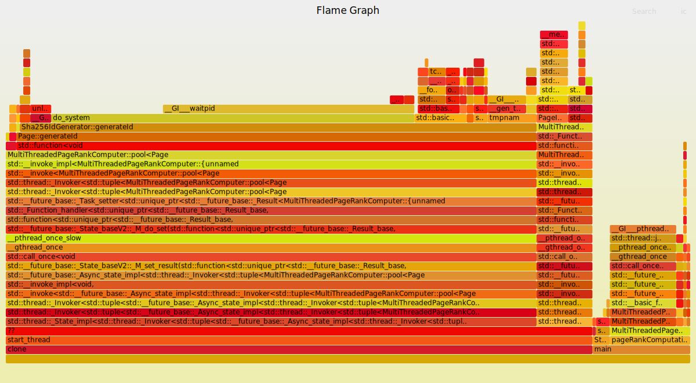

# Specification:

- PC
    - OS: Arch Linux
    - Kernel: x86_64 Linux 5.10.11-arch1-1
    - CPU: Intel Core i7-7700HQ @ 8x 2.8GHz (Turbo 3.8 GHz)
        - Thread(s) per core:              2
        - Core(s) per socket:              4
        - Socket(s):                       1
        - L1d cache:                       128 KiB
        - L1i cache:                       128 KiB
        - L2 cache:                        1 MiB
        - L3 cache:                        6 MiB
    - GPU: GeForce GTX 1050
    - RAM: 16GiB (DDR4 2133 MT/s)
- "Students"
    - OS: Debian
    - Kernel: Linux version 4.19.0-10-amd64 (debian-kernel@lists.debian.org) (gcc version 8.3.0 (Debian 8.3.0-6)) #1 SMP Debian 4.19.132-1 (2020-07-24)
    - CPU: Intel Xeon Processor (Skylake, IBRS)
        - Thread(s) per core:  1
        - Core(s) per socket:  1
        - Socket(s):           64
        - L1d cache:           32K
        - L1i cache:           32K
        - L2 cache:            4096K
        - L3 cache:            16384K
    - RAM: 328GiB

# Performance:

## PageRank Performance Test

- PC:

    ```
  [100 nodes, SingleThreadedPageRankComputer] took: 0.00717281s
  [1000 nodes, SingleThreadedPageRankComputer] took:   1.25302s
  [2000 nodes, SingleThreadedPageRankComputer] took:   4.87889s
  [2000 nodes, MultiThreadedPageRankComputer[1]] took:   4.04874s
  [2000 nodes, MultiThreadedPageRankComputer[2]] took:   2.40625s
  [2000 nodes, MultiThreadedPageRankComputer[3]] took:   1.87004s
  [2000 nodes, MultiThreadedPageRankComputer[4]] took:   1.58552s
  [2000 nodes, MultiThreadedPageRankComputer[8]] took:   1.26022s
  [500000 nodes, SingleThreadedPageRankComputer] took:   8.35237s
  [500000 nodes, MultiThreadedPageRankComputer[1]] took:   7.16307s
  [500000 nodes, MultiThreadedPageRankComputer[2]] took:   6.73679s
  [500000 nodes, MultiThreadedPageRankComputer[3]] took:   6.74757s
  [500000 nodes, MultiThreadedPageRankComputer[4]] took:   6.71989s
  [500000 nodes, MultiThreadedPageRankComputer[8]] took:   6.96794s
    ```

- "Students":

    ```
  [100 nodes, SingleThreadedPageRankComputer] took: 0.0100106s
  [1000 nodes, SingleThreadedPageRankComputer] took:   1.49933s
  [2000 nodes, SingleThreadedPageRankComputer] took:   6.20531s
  [2000 nodes, MultiThreadedPageRankComputer[1]] took:   5.32454s
  [2000 nodes, MultiThreadedPageRankComputer[2]] took:   3.55846s
  [2000 nodes, MultiThreadedPageRankComputer[3]] took:   2.79775s
  [2000 nodes, MultiThreadedPageRankComputer[4]] took:   2.61822s
  [2000 nodes, MultiThreadedPageRankComputer[8]] took:   2.01342s
  [500000 nodes, SingleThreadedPageRankComputer] took:   15.7778s
  [500000 nodes, MultiThreadedPageRankComputer[1]] took:   13.8343s
  [500000 nodes, MultiThreadedPageRankComputer[2]] took:   12.4708s
  [500000 nodes, MultiThreadedPageRankComputer[3]] took:   13.5485s
  [500000 nodes, MultiThreadedPageRankComputer[4]] took:   13.2623s
  [500000 nodes, MultiThreadedPageRankComputer[8]] took:   17.7141s
     ```

## E2E Test

- PC:
  ```
  [SingleThreadedPageRankComputer] took:   6.98984s
  [MultiThreadedPageRankComputer[1]] took:   6.77007s
  [MultiThreadedPageRankComputer[2]] took:   3.55695s
  [MultiThreadedPageRankComputer[3]] took:   2.48716s
  [MultiThreadedPageRankComputer[4]] took:   2.02084s
  [MultiThreadedPageRankComputer[8]] took:   1.53302s
  ```
- "Students":

  ```
  [SingleThreadedPageRankComputer] took:   13.6398s
  [MultiThreadedPageRankComputer[1]] took:   12.8399s
  [MultiThreadedPageRankComputer[2]] took:   8.11722s
  [MultiThreadedPageRankComputer[3]] took:   5.69364s
  [MultiThreadedPageRankComputer[4]] took:   4.56782s
  [MultiThreadedPageRankComputer[8]] took:    4.1929s
  ```

Execution times do not decrease linearly, as the number of cores increase, because of the overhead of parallelization (as noted by the flame graphs below, most of the time is spent inside 'clone'
kernel call, which is used to spawn a new process).

# FlameGraphs:

PageRank Performance Test:

- PC:

  

- "Students":

  

## E2E Test:

- PC:

  

- "Students":

  
